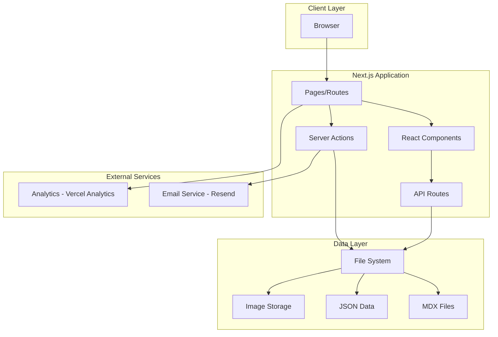

# Design Document: Portfolio Enhancement

## Overview

This design document outlines the technical architecture for transforming a basic Next.js starter into a fully-featured portfolio website. The system will use Next.js 16 App Router, TypeScript, Tailwind CSS, and a file-based content management approach with MDX for blog posts and JSON for structured data. This approach minimizes infrastructure complexity while maintaining flexibility and performance.

## Architecture

### High-Level Architecture



### Technology Stack

- **Framework**: Next.js 16.1.1 with App Router
- **Language**: TypeScript 5.x (strict mode)
- **Styling**: Tailwind CSS 4
- **Content**: MDX for blog posts, JSON for structured data
- **Email**: Resend API for contact form
- **Analytics**: Vercel Analytics (privacy-friendly)
- **Image Optimization**: Next.js Image component with local storage
- **Validation**: Zod for runtime type validation
- **Forms**: React Hook Form with Zod resolver

### Directory Structure

```
src/
├── app/
│   ├── (routes)/
│   │   ├── page.tsx                 # Homepage
│   │   ├── about/
│   │   │   └── page.tsx            # About page
│   │   ├── projects/
│   │   │   ├── page.tsx            # Projects list
│   │   │   └── [slug]/
│   │   │       └── page.tsx        # Project detail
│   │   ├── blog/
│   │   │   ├── page.tsx            # Blog list
│   │   │   ├── tag/
│   │   │   │   └── [tag]/
│   │   │   │       └── page.tsx    # Posts by tag
│   │   │   └── [slug]/
│   │   │       └── page.tsx        # Blog post
│   │   └── contact/
│   │       └── page.tsx            # Contact page
│   ├── api/
│   │   └── contact/
│   │       └── route.ts            # Contact form API
│   ├── layout.tsx                   # Root layout
│   ├── globals.css                  # Global styles
│   └── not-found.tsx               # 404 page
├── components/
│   ├── ui/                          # Reusable UI components
│   │   ├── Button.tsx
│   │   ├── Card.tsx
│   │   ├── Input.tsx
│   │   └── ...
│   ├── layout/
│   │   ├── Header.tsx
│   │   ├── Footer.tsx
│   │   └── Navigation.tsx
│   ├── projects/
│   │   ├── ProjectCard.tsx
│   │   ├── ProjectGrid.tsx
│   │   └── ProjectFilter.tsx
│   ├── blog/
│   │   ├── BlogCard.tsx
│   │   ├── BlogList.tsx
│   │   └── MDXComponents.tsx
│   └── contact/
│       └── ContactForm.tsx
├── lib/
│   ├── data/
│   │   ├── projects.ts              # Project data utilities
│   │   ├── blog.ts                  # Blog data utilities
│   │   └── about.ts                 # About data utilities
│   ├── validations/
│   │   ├── contact.ts               # Contact form schema
│   │   └── schemas.ts               # Shared schemas
│   ├── utils/
│   │   ├── mdx.ts                   # MDX processing
│   │   ├── date.ts                  # Date formatting
│   │   └── seo.ts                   # SEO utilities
│   └── email/
│       └── resend.ts                # Email service
├── content/
│   ├── projects/
│   │   └── projects.json            # Project data
│   ├── blog/
│   │   ├── post-1.mdx
│   │   ├── post-2.mdx
│   │   └── ...
│   └── about/
│       ├── bio.json                 # Biography data
│       ├── skills.json              # Skills data
│       └── experience.json          # Experience data
└── public/
    ├── images/
    │   ├── projects/
    │   ├── blog/
    │   └── profile/
    └── ...
```

## Components and Interfaces

### Core Data Types

```typescript
// Project Type
interface Project {
  id: string;
  title: string;
  slug: string;
  description: string;
  longDescription: string;
  technologies: string[];
  images: string[];
  thumbnailImage: string;
  demoUrl?: string;
  githubUrl?: string;
  featured: boolean;
  startDate: string;
  endDate?: string;
  status: 'completed' | 'in-progress' | 'archived';
}

// Blog Post Type
interface BlogPost {
  slug: string;
  title: string;
  description: string;
  publishedAt: string;
  updatedAt?: string;
  author: string;
  tags: string[];
  readingTime: number;
  featured: boolean;
  content: string; // MDX content
}

// Blog Post Metadata (frontmatter)
interface BlogPostMetadata {
  title: string;
  description: string;
  publishedAt: string;
  updatedAt?: string;
  author: string;
  tags: string[];
  featured: boolean;
}

// Skill Type
interface Skill {
  name: string;
  category: 'frontend' | 'backend' | 'database' | 'devops' | 'tools' | 'other';
  proficiency: 'beginner' | 'intermediate' | 'advanced' | 'expert';
  icon?: string;
}

// Experience Type
interface Experience {
  id: string;
  company: string;
  position: string;
  location: string;
  startDate: string;
  endDate?: string;
  current: boolean;
  description: string;
  achievements: string[];
  technologies: string[];
}

// Education Type
interface Education {
  id: string;
  institution: string;
  degree: string;
  field: string;
  startDate: string;
  endDate?: string;
  gpa?: string;
  achievements: string[];
}

// Bio Type
interface Bio {
  name: string;
  title: string;
  tagline: string;
  bio: string;
  profileImage: string;
  resumeUrl?: string;
  social: {
    github?: string;
    linkedin?: string;
    twitter?: string;
    email: string;
  };
}

// Contact Form Type
interface ContactFormData {
  name: string;
  email: string;
  subject: string;
  message: string;
}

// Contact Submission Type (stored)
interface ContactSubmission extends ContactFormData {
  id: string;
  submittedAt: string;
  ipAddress?: string;
  userAgent?: string;
}

// SEO Metadata Type
interface SEOMetadata {
  title: string;
  description: string;
  keywords?: string[];
  ogImage?: string;
  ogType?: string;
  canonicalUrl?: string;
  noindex?: boolean;
}
```

### Key Components

#### 1. Navigation Component
```typescript
interface NavigationProps {
  currentPath: string;
}

// Features:
// - Responsive header with logo
// - Desktop: horizontal nav links
// - Mobile: hamburger menu
// - Active link highlighting
// - Smooth scroll behavior
```

#### 2. Project Components
```typescript
interface ProjectCardProps {
  project: Project;
  variant?: 'default' | 'featured';
}

interface ProjectGridProps {
  projects: Project[];
  showFilter?: boolean;
}

interface ProjectFilterProps {
  technologies: string[];
  selectedTechnologies: string[];
  onFilterChange: (technologies: string[]) => void;
}
```

#### 3. Blog Components
```typescript
interface BlogCardProps {
  post: BlogPost;
  variant?: 'default' | 'featured';
}

interface BlogListProps {
  posts: BlogPost[];
  showFeatured?: boolean;
}

interface MDXComponentsProps {
  // Custom components for MDX rendering
  components: Record<string, React.ComponentType>;
}
```

#### 4. Contact Form Component
```typescript
interface ContactFormProps {
  onSuccess?: () => void;
  onError?: (error: Error) => void;
}

// Features:
// - Real-time validation
// - Loading states
// - Success/error messages
// - Accessibility compliant
```

### Data Access Layer

```typescript
// lib/data/projects.ts
export async function getAllProjects(): Promise<Project[]>
export async function getProjectBySlug(slug: string): Promise<Project | null>
export async function getFeaturedProjects(): Promise<Project[]>
export async function getProjectsByTechnology(tech: string): Promise<Project[]>
export async function getAllTechnologies(): Promise<string[]>

// lib/data/blog.ts
export async function getAllPosts(): Promise<BlogPost[]>
export async function getPostBySlug(slug: string): Promise<BlogPost | null>
export async function getFeaturedPosts(): Promise<BlogPost[]>
export async function getPostsByTag(tag: string): Promise<BlogPost[]>
export async function getAllTags(): Promise<string[]>
export async function calculateReadingTime(content: string): number

// lib/data/about.ts
export async function getBio(): Promise<Bio>
export async function getSkills(): Promise<Skill[]>
export async function getExperience(): Promise<Experience[]>
export async function getEducation(): Promise<Education[]>
```

## Data Models

### File-Based Content Structure

#### Projects Data (`content/projects/projects.json`)
```json
{
  "projects": [
    {
      "id": "project-1",
      "title": "E-Commerce Platform",
      "slug": "ecommerce-platform",
      "description": "A full-stack e-commerce solution",
      "longDescription": "Detailed description...",
      "technologies": ["Next.js", "TypeScript", "PostgreSQL"],
      "images": ["/images/projects/ecommerce-1.jpg"],
      "thumbnailImage": "/images/projects/ecommerce-thumb.jpg",
      "demoUrl": "https://demo.example.com",
      "githubUrl": "https://github.com/user/repo",
      "featured": true,
      "startDate": "2024-01-01",
      "endDate": "2024-06-01",
      "status": "completed"
    }
  ]
}
```

#### Blog Post (`content/blog/my-first-post.mdx`)
```mdx
---
title: "My First Blog Post"
description: "An introduction to my blog"
publishedAt: "2024-01-15"
author: "Your Name"
tags: ["web-development", "nextjs"]
featured: true
---

# My First Blog Post

Content goes here...
```

#### Bio Data (`content/about/bio.json`)
```json
{
  "name": "Your Name",
  "title": "Full Stack Developer",
  "tagline": "Building amazing web experiences",
  "bio": "I'm a passionate developer...",
  "profileImage": "/images/profile/avatar.jpg",
  "resumeUrl": "/resume.pdf",
  "social": {
    "github": "https://github.com/username",
    "linkedin": "https://linkedin.com/in/username",
    "twitter": "https://twitter.com/username",
    "email": "hello@example.com"
  }
}
```

#### Skills Data (`content/about/skills.json`)
```json
{
  "skills": [
    {
      "name": "React",
      "category": "frontend",
      "proficiency": "expert",
      "icon": "react"
    },
    {
      "name": "Node.js",
      "category": "backend",
      "proficiency": "advanced",
      "icon": "nodejs"
    }
  ]
}
```

#### Experience Data (`content/about/experience.json`)
```json
{
  "experience": [
    {
      "id": "exp-1",
      "company": "Tech Company",
      "position": "Senior Developer",
      "location": "Remote",
      "startDate": "2022-01-01",
      "endDate": null,
      "current": true,
      "description": "Leading development of...",
      "achievements": [
        "Improved performance by 40%",
        "Led team of 5 developers"
      ],
      "technologies": ["React", "Node.js", "AWS"]
    }
  ]
}
```

### Contact Submissions Storage

Contact form submissions will be stored in `content/contact/submissions.json`:

```json
{
  "submissions": [
    {
      "id": "sub-1",
      "name": "John Doe",
      "email": "john@example.com",
      "subject": "Project Inquiry",
      "message": "I'd like to discuss...",
      "submittedAt": "2024-01-15T10:30:00Z",
      "ipAddress": "192.168.1.1",
      "userAgent": "Mozilla/5.0..."
    }
  ]
}
```

## Correctness Properties

*A property is a characteristic or behavior that should hold true across all valid executions of a system—essentially, a formal statement about what the system should do. Properties serve as the bridge between human-readable specifications and machine-verifiable correctness guarantees.*

### Property 1: Project Retrieval Consistency
*For any* project slug that exists in the projects data, retrieving the project by slug and then accessing its slug field should return the original slug value.
**Validates: Requirements 1.2**

### Property 2: Blog Post Chronological Ordering
*For any* list of blog posts returned by getAllPosts, each post's publishedAt date should be greater than or equal to the next post's publishedAt date (reverse chronological order).
**Validates: Requirements 4.1**

### Property 3: Technology Filter Correctness
*For any* technology string, all projects returned by getProjectsByTechnology should include that technology in their technologies array.
**Validates: Requirements 1.7**

### Property 4: Tag Filter Correctness
*For any* tag string, all blog posts returned by getPostsByTag should include that tag in their tags array.
**Validates: Requirements 4.5**

### Property 5: Contact Form Validation
*For any* contact form submission with empty required fields (name, email, subject, or message), the validation should reject the submission and return appropriate error messages.
**Validates: Requirements 3.4**

### Property 6: Email Format Validation
*For any* string that does not match a valid email format, the contact form validation should reject it as an invalid email.
**Validates: Requirements 3.3**

### Property 7: Reading Time Calculation
*For any* blog post content, the calculated reading time should be a positive integer representing minutes, and should increase monotonically with content length.
**Validates: Requirements 4.6**

### Property 8: SEO Metadata Completeness
*For any* page that generates SEO metadata, the metadata object should contain non-empty title and description fields.
**Validates: Requirements 6.1**

### Property 9: Image Path Validity
*For any* project or blog post with images, all image paths should start with "/images/" or be valid external URLs starting with "http://" or "https://".
**Validates: Requirements 1.3, 4.3**

### Property 10: Slug Uniqueness
*For any* collection of projects or blog posts, no two items should have the same slug value.
**Validates: Requirements 1.2, 4.2**

### Property 11: Date Format Consistency
*For any* date string in the system (publishedAt, startDate, endDate), it should be in ISO 8601 format (YYYY-MM-DD or full ISO datetime).
**Validates: Requirements 1.6, 4.3**

### Property 12: Featured Content Subset
*For any* call to getFeaturedProjects or getFeaturedPosts, the returned items should be a subset of all projects/posts where featured is true.
**Validates: Requirements 1.1, 4.1**

### Property 13: Social Link Validation
*For any* social media link in the bio data, it should be either undefined or a valid URL starting with "http://" or "https://".
**Validates: Requirements 2.6**

### Property 14: Experience Chronological Ordering
*For any* list of experience entries, they should be ordered by startDate in reverse chronological order (most recent first).
**Validates: Requirements 2.4**

### Property 15: Contact Submission Storage
*For any* valid contact form submission, after successful processing, the submission should be stored with a unique ID and timestamp.
**Validates: Requirements 10.7**

## Error Handling

### Error Types

```typescript
class ProjectNotFoundError extends Error {
  constructor(slug: string) {
    super(`Project with slug "${slug}" not found`);
    this.name = 'ProjectNotFoundError';
  }
}

class BlogPostNotFoundError extends Error {
  constructor(slug: string) {
    super(`Blog post with slug "${slug}" not found`);
    this.name = 'BlogPostNotFoundError';
  }
}

class ValidationError extends Error {
  constructor(message: string, public fields: Record<string, string>) {
    super(message);
    this.name = 'ValidationError';
  }
}

class EmailSendError extends Error {
  constructor(message: string) {
    super(message);
    this.name = 'EmailSendError';
  }
}

class FileReadError extends Error {
  constructor(path: string, cause?: Error) {
    super(`Failed to read file: ${path}`);
    this.name = 'FileReadError';
    this.cause = cause;
  }
}
```

### Error Handling Strategy

1. **Data Loading Errors**:
   - Gracefully handle missing files with empty arrays or null
   - Log errors to console in development
   - Show user-friendly error messages in production
   - Use Next.js error boundaries for component errors

2. **Validation Errors**:
   - Return detailed field-level errors to users
   - Prevent form submission until all errors are resolved
   - Display inline validation messages

3. **API Errors**:
   - Return appropriate HTTP status codes (400, 404, 500)
   - Include error messages in response body
   - Log errors for monitoring

4. **404 Handling**:
   - Custom 404 page with navigation
   - Automatic 404 for non-existent slugs
   - Suggestions for similar content

## Testing Strategy

### Unit Testing
- Test data access functions with mock file system
- Test validation schemas with valid and invalid inputs
- Test utility functions (date formatting, reading time calculation)
- Test component rendering with React Testing Library
- Focus on edge cases: empty data, malformed data, missing fields

### Property-Based Testing
- Use `fast-check` library for property-based testing in TypeScript
- Each property test should run minimum 100 iterations
- Tag each test with feature name and property number
- Test data transformation functions with random inputs
- Test validation logic with generated valid/invalid data

**Property Test Examples**:
```typescript
// Feature: portfolio-enhancement, Property 1: Project Retrieval Consistency
test('project slug round-trip', () => {
  fc.assert(
    fc.property(fc.string(), async (slug) => {
      const project = await getProjectBySlug(slug);
      if (project) {
        expect(project.slug).toBe(slug);
      }
    })
  );
});

// Feature: portfolio-enhancement, Property 3: Technology Filter Correctness
test('technology filter returns only matching projects', () => {
  fc.assert(
    fc.property(fc.string(), async (tech) => {
      const projects = await getProjectsByTechnology(tech);
      projects.forEach(project => {
        expect(project.technologies).toContain(tech);
      });
    })
  );
});
```

### Integration Testing
- Test API routes with supertest
- Test form submissions end-to-end
- Test email sending with mock email service
- Test file reading/writing operations
- Test MDX processing pipeline

### E2E Testing (Optional)
- Use Playwright for critical user flows
- Test navigation between pages
- Test contact form submission
- Test project filtering
- Test blog post reading

### Testing Configuration
- Use Vitest as the test runner (fast, Vite-powered)
- Configure with TypeScript support
- Set up test coverage reporting (aim for 80%+ coverage)
- Run tests in CI/CD pipeline

## Performance Considerations

1. **Static Generation**:
   - Use `generateStaticParams` for all dynamic routes
   - Pre-render all project and blog post pages at build time
   - Regenerate pages on content changes

2. **Image Optimization**:
   - Use Next.js Image component for all images
   - Generate multiple sizes for responsive images
   - Use WebP format with fallbacks
   - Lazy load below-the-fold images

3. **Code Splitting**:
   - Automatic code splitting per route
   - Dynamic imports for heavy components
   - Lazy load MDX components

4. **Caching**:
   - Cache file reads in memory during development
   - Use Next.js built-in caching for production
   - Set appropriate cache headers for static assets

5. **Bundle Size**:
   - Tree-shake unused code
   - Use dynamic imports for large dependencies
   - Monitor bundle size with Next.js analyzer

## Security Considerations

1. **Input Validation**:
   - Validate all user inputs with Zod schemas
   - Sanitize contact form inputs
   - Prevent XSS attacks in user-generated content

2. **Rate Limiting**:
   - Implement rate limiting on contact form API
   - Use Vercel's built-in DDoS protection
   - Consider adding CAPTCHA for contact form

3. **Environment Variables**:
   - Store sensitive data (API keys) in environment variables
   - Never commit `.env` files to version control
   - Use different keys for development and production

4. **Content Security**:
   - Validate file paths to prevent directory traversal
   - Sanitize MDX content before rendering
   - Use Content Security Policy headers

## Deployment Strategy

1. **Vercel Deployment** (Recommended):
   - Connect GitHub repository
   - Automatic deployments on push to main
   - Preview deployments for pull requests
   - Environment variables configured in Vercel dashboard

2. **Build Process**:
   - Run type checking before build
   - Run linting before build
   - Generate static pages for all routes
   - Optimize images during build

3. **Environment Setup**:
   - Development: `.env.local`
   - Production: Vercel environment variables
   - Required variables:
     - `RESEND_API_KEY`: Email service API key
     - `CONTACT_EMAIL`: Email address to receive contact form submissions
     - `NEXT_PUBLIC_SITE_URL`: Full site URL for SEO

4. **Monitoring**:
   - Use Vercel Analytics for performance monitoring
   - Set up error tracking (optional: Sentry)
   - Monitor Core Web Vitals
   - Track contact form conversion rate

## Accessibility Compliance

1. **WCAG AA Standards**:
   - Color contrast ratio minimum 4.5:1
   - All interactive elements keyboard accessible
   - Focus indicators visible on all focusable elements
   - Semantic HTML throughout

2. **ARIA Labels**:
   - Descriptive labels for all form inputs
   - ARIA labels for icon buttons
   - ARIA live regions for dynamic content
   - Proper heading hierarchy

3. **Screen Reader Support**:
   - Alt text for all images
   - Skip to main content link
   - Descriptive link text (no "click here")
   - Proper form labels and error messages

4. **Keyboard Navigation**:
   - Tab order follows visual order
   - All interactive elements reachable via keyboard
   - Escape key closes modals/menus
   - Enter/Space activates buttons

## SEO Implementation

1. **Metadata Generation**:
   - Dynamic metadata for each page
   - Open Graph tags for social sharing
   - Twitter Card tags
   - Canonical URLs

2. **Structured Data**:
   - JSON-LD for Person schema (about page)
   - JSON-LD for BlogPosting schema (blog posts)
   - JSON-LD for CreativeWork schema (projects)
   - Breadcrumb structured data

3. **Sitemap Generation**:
   - Dynamic sitemap.xml generation
   - Include all public pages
   - Update on content changes
   - Submit to search engines

4. **Robots.txt**:
   - Allow all pages except admin/private
   - Reference sitemap location
   - Set crawl delay if needed

## Future Enhancements

1. **CMS Integration**:
   - Consider Sanity or Contentful for easier content management
   - Keep file-based approach as fallback

2. **Search Functionality**:
   - Add search for blog posts and projects
   - Use Algolia or local search with Fuse.js

3. **Comments System**:
   - Add comments to blog posts
   - Use Giscus (GitHub Discussions) or similar

4. **Newsletter**:
   - Add email newsletter signup
   - Integrate with email service provider

5. **Dark Mode Toggle**:
   - Add manual dark mode toggle
   - Persist user preference

6. **Internationalization**:
   - Add multi-language support
   - Use next-intl or similar

7. **RSS Feed**:
   - Generate RSS feed for blog posts
   - Allow readers to subscribe

8. **View Counter**:
   - Track and display view counts for blog posts
   - Use edge database or analytics API

